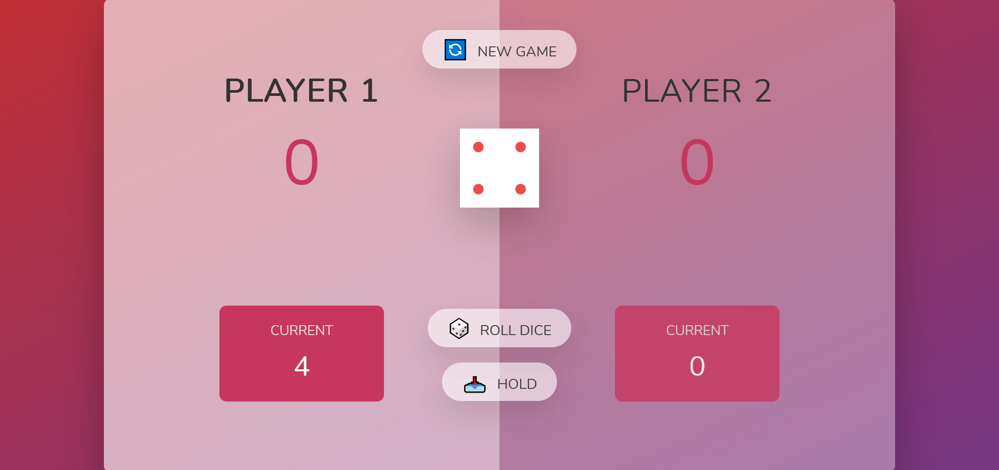
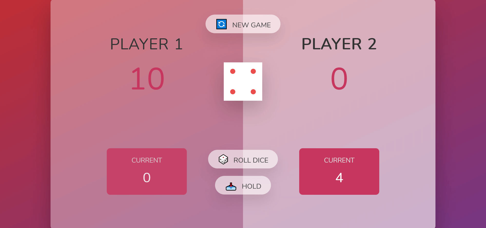
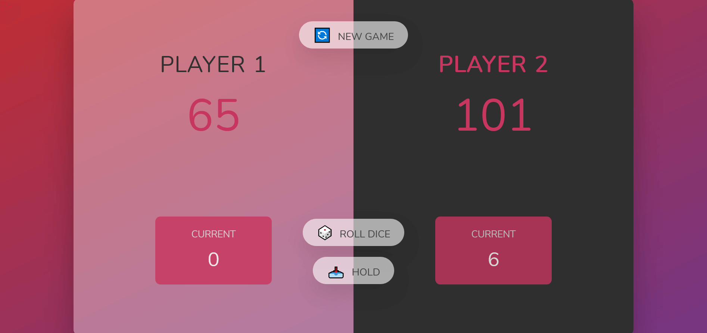

# Pig-Game App

## Table of contents

- [Overview](#overview)
  - [The challenge](#the-challenge)
  - [Links](#links)
  - [Screenshot](#screenshot)
- [My process](#my-process)
  - [Built with](#built-with)
- [Author](#author)

## Overview

Users should be able to:

- Start a new game when pressing the button
- Hold points
- Whoever collects 100 points, wins
- Desktop only design

### Links

- GitHub URL: [https://github.com/Nesh00/pig-game]
- Live Site URL: [https://pig-game-nenad.netlify.app/]

### Screenshot

## My process

### Built with

- Semantic HTML5 markup
- CSS custom properties
- JavaScript

## Author

- LinkedIn - [https://www.linkedin.com/in/nenad-tsvetanovski-3101b474/]
- Twitter - [https://twitter.com/nenad37452460]
